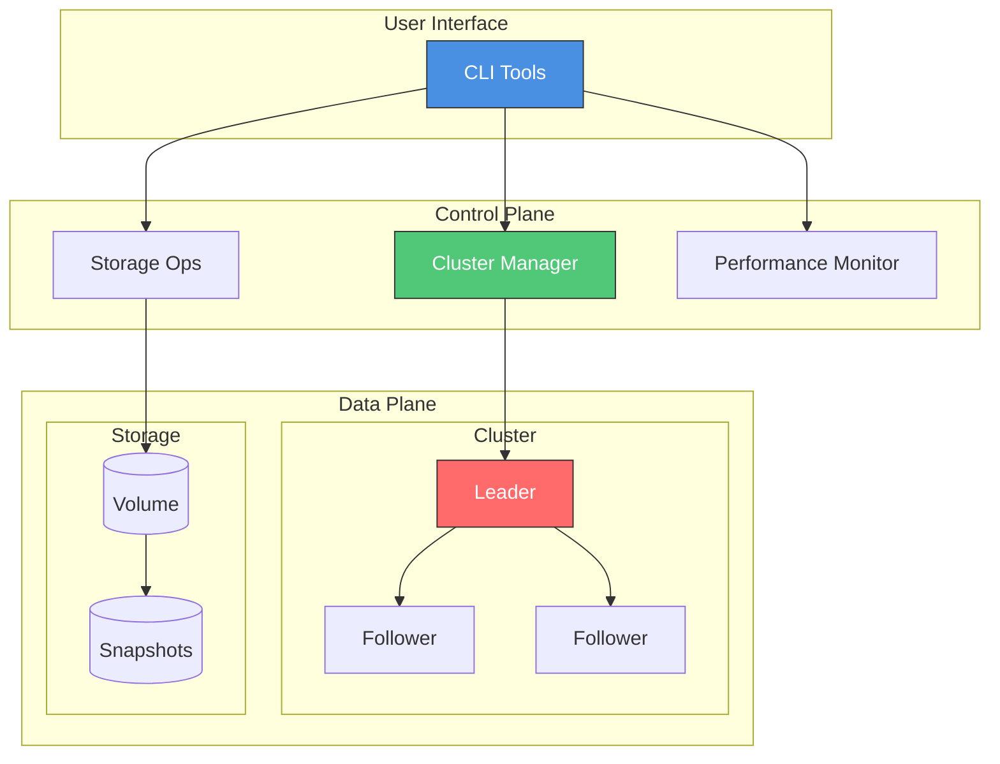

# Quorum CLI - Distributed Storage Platform


A production-grade command-line tool suite for managing distributed storage systems, data replication, and cluster operations - built entirely with Linux CLI tools.

## 🎯 Project Overview

This project simulates a distributed storage platform with:
- **Multi-node cluster management** (simulated Cassandra/Kafka-like clusters)
- **Data replication and consistency checking** (quorum-based)
- **Storage performance monitoring and optimization** (real-time metrics)
- **Automated backup and disaster recovery** (snapshots with retention)
- **Cluster health monitoring and auto-remediation** (leader election, failover)
- **Network partition detection and handling** (chaos engineering)

## 📊 Demo

[Demo Walkthrough](./Demo.md)


# Quorum CLI - System Architecture


## 📋 Live Demo Results

### Cluster Status
```
╔════════════════════════════════════════════════════════════════╗
║          CLUSTER STATUS: production-cluster                    ║
╚════════════════════════════════════════════════════════════════╝

Cluster ID:          cls-1771139913-f015c8
Name:                production-cluster
Status:              HEALTHY
Node Count:          3

Nodes:
  node-1 [LEADER]      UP    Load: 26%    Address: 192.168.1.101:7001
  node-2 [FOLLOWER]    UP    Load: 24%    Address: 192.168.1.102:7002
  node-3 [FOLLOWER]    UP    Load: 31%    Address: 192.168.1.103:7003
```

### Test Results
```
Tests Run:      10
Tests Passed:   10
Success Rate:   100%

✓ ALL TESTS PASSED!
```

## 🚀 Key Features

### 1. Cluster Management
```bash
./bin/cluster-manager.sh create --nodes 3 --type cassandra
./bin/cluster-manager.sh status --cluster-id cls-001
./bin/cluster-manager.sh add-node --cluster-id cls-001
./bin/cluster-manager.sh list
```

### 2. Storage Operations
```bash
./bin/storage-ops.sh provision --cluster-id cls-001 --size 10GB
./bin/storage-ops.sh snapshot --volume-id vol-001
./bin/storage-ops.sh verify --volume-id vol-001
./bin/storage-ops.sh stats
```

### 3. Performance Monitoring
```bash
./bin/perf-monitor.sh dashboard --cluster-id cls-001
./bin/perf-monitor.sh analyze --cluster-id cls-001
./bin/perf-monitor.sh report --cluster-id cls-001
```

### 4. Chaos Engineering
```bash
./scripts/chaos-engineering.sh kill-node --cluster-id cls-001 --node-id node-2
./scripts/chaos-engineering.sh high-load --cluster-id cls-001
```

### 5. Automated Demo
```bash
./scripts/demo.sh  # Shows all features in action!
```

## 📁 Project Structure (ACTUAL FILES)

```
Quorum-CLI/
├── bin/
│   ├── cluster-manager.sh    # Cluster management
│   ├── storage-ops.sh        # Storage operations
│   └── perf-monitor.sh       # Performance monitoring
├── lib/
│   ├── logger.sh             # Logging framework
│   └── cluster-lib.sh        # Cluster utilities
├── scripts/
│   ├── demo.sh               # Automated demo
│   └── chaos-engineering.sh  # Failure simulation
├── tests/
│   └── integration-tests.sh  # Test suite
├── config/
│   └── cluster.conf          # Configuration
└── docs/
    ├── QUICKSTART.md
    └── DEMO_WALKTHROUGH.md
```

## 🚀 Quick Start

```bash
# Clone and setup
git clone https://github.com/joshuabvarghese/Quorum-CLI.git
cd Quorum-CLI

# Make scripts executable
chmod +x bin/*.sh scripts/*.sh tests/*.sh

# Initialize
./bin/cluster-manager.sh init

# Run demo
./scripts/demo.sh
```

## 🧪 Testing

```bash
# Run all tests
./tests/integration-tests.sh
```
