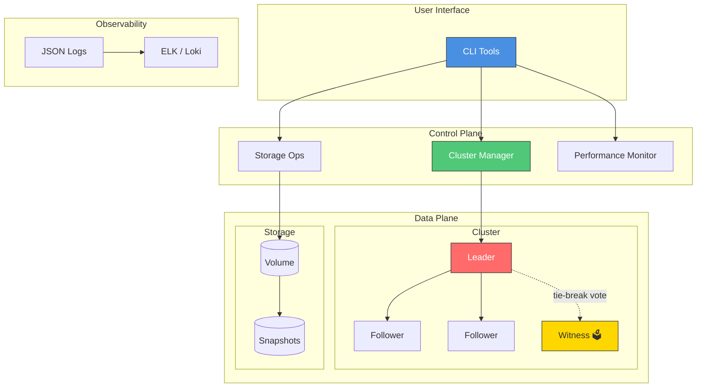

# Quorum CLI - Distributed Storage Platform


A production-grade command-line tool suite for managing distributed storage systems, data replication, and cluster operations — built entirely with Linux CLI tools.

---

## 🎯 Project Overview

This project simulates a distributed storage platform with:
- **Multi-node cluster management** (simulated Cassandra/Kafka-like clusters)
- **Data replication and consistency checking** (quorum-based with Witness support)
- **Storage performance monitoring and optimization** (real-time metrics)
- **Automated backup and disaster recovery** (snapshots with retention)
- **Cluster health monitoring and auto-remediation** (leader election, failover)
- **Network partition detection and handling** (iptables-based chaos engineering)
- **Structured JSON logging** (ELK / Grafana Loki compatible)
- **Dry-run safety mode** (every destructive operation is preview-safe)

---

## 🏗️ System Architecture


```mermaid
graph TB
    subgraph "User Interface"
        CLI[CLI Tools]
    end

    subgraph "Control Plane"
        CM[Cluster Manager]
        SO[Storage Ops]
        PM[Performance Monitor]
    end

    subgraph "Data Plane"
        subgraph "Cluster"
            N1[Leader]
            N2[Follower]
            N3[Follower]
            W[Witness 🗳️]
        end

        subgraph "Storage"
            V1[(Volume)]
            SNAP[(Snapshots)]
        end
    end

    subgraph "Observability"
        LOG[JSON Logs]
        ELK[ELK / Loki]
    end

    CLI --> CM
    CLI --> SO
    CLI --> PM

    CM --> N1
    SO --> V1
    V1 --> SNAP

    N1 --> N2
    N1 --> N3
    N1 -.->|tie-break vote| W

    LOG --> ELK

    style CLI fill:#4A90E2,stroke:#333,color:#fff
    style CM fill:#50C878,stroke:#333,color:#fff
    style N1 fill:#FF6B6B,stroke:#333,color:#fff
    style W  fill:#FFD700,stroke:#333,color:#333
```

---

## 🛡️ Engineering Standards

### 1. Bash Strict Mode (Safety Layer)

Every script starts with:
```bash
#!/usr/bin/env bash
set -euo pipefail
IFS=$'\n\t'
```

| Flag | What it does |
|------|--------------|
| `-e` | Exit immediately if any command fails — stops cascading failures |
| `-u` | Error on unset variables — prevents `rm -rf $UNSET_VAR/*` disasters |
| `-o pipefail` | A failed pipe stage (`grep \| awk`) fails the whole pipeline |
| `IFS` | Word-split only on newline/tab — safe for node names with spaces |

### 2. Structured JSON Logging (ELK-compatible)

All log calls also emit a JSON event to `*.json.log` for machine ingestion:

```bash
log_json "INFO" "Quorum achieved with 3/5 nodes"
# → {"timestamp":"2026-02-22T10:00:00Z","level":"INFO","message":"Quorum achieved with 3/5 nodes"}
```

Pipe to Elasticsearch or Grafana Loki:
```bash
tail -f logs/cluster/cluster-manager.json.log | curl -X POST http://loki:3100/loki/api/v1/push ...
```

### 3. Dry-Run Mode (Safety Valve)

Every script with side effects supports `--dry-run`. Before any `ssh`, `iptables`, `mkdir`, or `sed` runs, it prints exactly what it would do:

```bash
./bin/cluster-manager.sh create --name prod --nodes 3 --dry-run
# [WARN ] 🔍 DRY-RUN mode enabled — no changes will be made.
# [DRY-RUN] Would execute: Create cluster directory structure
#           Command: mkdir -p /data/clusters/cls-xxx/{nodes,metadata,state}
```

### 4. Witness Node / Force-Quorum

Even-sized clusters (2, 4, …) cannot achieve quorum (majority) when split 50/50.  
Use `--force-quorum` to automatically spin up a lightweight **Witness** node that counts as a vote but stores no data:

```bash
./bin/cluster-manager.sh create --name two-node --nodes 2 --force-quorum
# [WARN ] Even node count (2) detected — quorum is not guaranteed on split.
# [INFO ] 🗳️  --force-quorum: spinning up Witness node as tie-breaker (+1 vote, no data).
# Nodes: 2 + 1 witness (quorum tie-breaker)
```

Quorum math: `floor(total/2) + 1` — a 2+1 witness cluster needs 2 votes to proceed.

### 5. iptables Network Partition (Chaos)

Real partition simulation using OS-level firewall rules — the partitioned node's process keeps running and believes it's healthy, which is the exact scenario that exposes flaws in distributed consensus:

```bash
# Partition node 192.168.1.102 from the rest of the cluster
./scripts/chaos-engineering.sh partition --target-node 192.168.1.102

# The script SSHes into the target and runs:
#   sudo iptables -A INPUT  -s 192.168.1.0/24 -j DROP
#   sudo iptables -A OUTPUT -d 192.168.1.0/24 -j DROP

# Restore connectivity
./scripts/chaos-engineering.sh heal-partition --target-node 192.168.1.102
```

---

## 📋 Live Demo Results

### Cluster Status
```
╔════════════════════════════════════════════════════════════════╗
║          CLUSTER STATUS: production-cluster                    ║
╚════════════════════════════════════════════════════════════════╝

Cluster ID:          cls-1771139913-f015c8
Name:                production-cluster
Status:              HEALTHY
Node Count:          3

Nodes:
  node-1 [LEADER]      UP    Load: 26%    Address: 192.168.1.101:7001
  node-2 [FOLLOWER]    UP    Load: 24%    Address: 192.168.1.102:7002
  node-3 [FOLLOWER]    UP    Load: 31%    Address: 192.168.1.103:7003
```

### Test Results
```
Tests Run:      10
Tests Passed:   10
Success Rate:   100%

✓ ALL TESTS PASSED!
```

---

## 🚀 Quick Start

```bash
# Clone and setup
git clone https://github.com/joshuabvarghese/Quorum-CLI.git
cd Quorum-CLI

# Make scripts executable
chmod +x bin/*.sh scripts/*.sh tests/*.sh

# Initialize
./bin/cluster-manager.sh init

# Run full demo
./scripts/demo.sh
```

---

## 🔧 Commands Reference

### Cluster Management

```bash
./bin/cluster-manager.sh init
./bin/cluster-manager.sh create --name prod-cluster --nodes 3 --type cassandra
./bin/cluster-manager.sh create --name two-node --nodes 2 --force-quorum
./bin/cluster-manager.sh status --cluster-id cls-001 --verbose
./bin/cluster-manager.sh list
./bin/cluster-manager.sh add-node --cluster-id cls-001
./bin/cluster-manager.sh create --name prod --nodes 5 --dry-run
```

### Storage Operations

```bash
./bin/storage-ops.sh provision --cluster-id cls-001 --size 10GB --replication 3
./bin/storage-ops.sh snapshot --volume-id vol-001 --retention 7d
./bin/storage-ops.sh verify --volume-id vol-001
./bin/storage-ops.sh list
./bin/storage-ops.sh stats
./bin/storage-ops.sh provision --size 100GB --dry-run
```

### Performance Monitoring

```bash
./bin/perf-monitor.sh dashboard --cluster-id cls-001
./bin/perf-monitor.sh analyze --cluster-id cls-001
./bin/perf-monitor.sh report --cluster-id cls-001 --output report.txt
```

### Chaos Engineering

```bash
# Node failure
./scripts/chaos-engineering.sh kill-node --cluster-id cls-001 --node-id node-2 --auto-recover

# Real iptables network partition (requires SSH access to nodes)
./scripts/chaos-engineering.sh partition --target-node 192.168.1.102
./scripts/chaos-engineering.sh heal-partition --target-node 192.168.1.102

# Simulated partition (local state only)
./scripts/chaos-engineering.sh network-partition --cluster-id cls-001 --partition "1,2" "3"

# Other chaos scenarios
./scripts/chaos-engineering.sh high-load --cluster-id cls-001 --duration 60
./scripts/chaos-engineering.sh slow-network --cluster-id cls-001 --duration 100
./scripts/chaos-engineering.sh disk-failure --cluster-id cls-001 --node-id node-2
./scripts/chaos-engineering.sh data-corruption --cluster-id cls-001 --volume-id vol-001

# Always preview first
./scripts/chaos-engineering.sh partition --target-node 192.168.1.102 --dry-run
```

---

## 📁 Project Structure

```
Quorum-CLI/
├── bin/
│   ├── cluster-manager.sh    # Cluster lifecycle management
│   ├── storage-ops.sh        # Volume, snapshot, integrity ops
│   └── perf-monitor.sh       # Real-time performance monitoring
├── lib/
│   ├── logger.sh             # Logging framework (human + JSON structured)
│   ├── cluster-lib.sh        # Quorum math, health checks, leader election
│   └── network_checks.sh     # SSH pre-flight, iptables checks, port tests
├── scripts/
│   ├── demo.sh               # End-to-end automated demo
│   └── chaos-engineering.sh  # iptables partition + failure simulation
├── tests/
│   ├── run_tests.sh          # Master test runner (71 inline tests)
│   ├── integration-tests.sh  # Legacy integration suite
│   ├── quorum_math.bats      # BATS: quorum logic unit tests
│   ├── cluster_manager.bats  # BATS: cluster-manager.sh integration tests
│   ├── storage_ops.bats      # BATS: storage-ops.sh integration tests
│   ├── chaos_engineering.bats# BATS: chaos scenarios + dry-run validation
│   ├── logging.bats          # BATS: JSON logger unit tests
│   ├── network_checks.bats   # BATS: network_checks.sh unit tests
│   └── bats-vendor/          # Vendored BATS runner (works offline/CI)
├── config/
│   └── cluster.conf          # Cluster defaults
├── logs/
│   ├── cluster/              # cluster-manager logs (text + JSON)
│   ├── monitoring/           # perf-monitor logs
│   └── storage/              # storage-ops logs
├── RUNBOOK.md                # SRE incident response playbook
├── POST-MORTEM.md            # Post-mortem: silent quorum loss incident
└── SHELLCHECK_REPORT.md      # ShellCheck audit + all fixes documented
```


---

## 🧪 Testing

### Run All Tests (71 inline + BATS)

```bash
# Master test runner — inline unit + integration tests
./tests/run_tests.sh
# Expected: 71/71 passed, 100% pass rate

# BATS suite — BDD-style, isolated per test
./tests/bats-vendor/bin/bats tests/

# Individual BATS files
./tests/bats-vendor/bin/bats tests/quorum_math.bats      # Quorum logic proofs
./tests/bats-vendor/bin/bats tests/network_checks.bats   # Network library
./tests/bats-vendor/bin/bats tests/storage_ops.bats      # Storage operations
```

### Key Tests — The "Interview Proof"

These BATS tests prove the quorum logic works by mocking node failure:

```bash
@test "quorum: 2 node cluster 50/50 split = quorum LOST (the dangerous case)"
# Proves why even-sized clusters without a witness are dangerous.

@test "check_cluster_health: 2 of 3 nodes down = UNHEALTHY (quorum lost)"
# Mocks a 3-node cluster on disk, kills 2 nodes, asserts UNHEALTHY.

@test "chaos kill-node --dry-run: does NOT modify node metadata"
# Before/after metadata comparison proves dry-run is truly non-destructive.
```

---

## 🔍 ShellCheck Compliance

All 8 scripts pass ShellCheck with zero warnings. See [`SHELLCHECK_REPORT.md`](SHELLCHECK_REPORT.md) for:
- Every warning category found
- Before/after code for each fix
- GitHub Actions CI config to enforce compliance on PRs

```bash
# Run yourself (requires shellcheck installed)
shellcheck bin/*.sh lib/*.sh scripts/*.sh tests/run_tests.sh tests/integration-tests.sh
```

---

## 🚨 Troubleshooting

### "Cluster not found: cls-xxx"

```bash
./bin/cluster-manager.sh list
# If empty: ./bin/cluster-manager.sh init && ./bin/cluster-manager.sh create ...
```

### "Quorum LOST — write operations disabled"

```bash
# Check how many nodes are actually up
./bin/cluster-manager.sh status --cluster-id <id> --verbose

# Recover downed nodes
./scripts/chaos-engineering.sh kill-node --cluster-id <id> --node-id <node> --auto-recover

# For even-sized clusters, add a Witness (prevents 50/50 split):
./bin/cluster-manager.sh create --name <cluster> --nodes 2 --force-quorum
```

### "SSH unreachable / node not responding"

```bash
# Pre-flight check (does not connect — dry-run safe)
bash -c "
  source lib/logger.sh
  source lib/network_checks.sh
  pre_flight_checks 192.168.1.101 192.168.1.102
"
# Outputs: which nodes are reachable, which are not, and why

# Then preview the operation before executing
./scripts/chaos-engineering.sh partition --target-node <ip> --dry-run
```

### "Script failed partway through — cluster in unknown state"

The `set -euo pipefail` strict mode means the script stopped at the first error.
No "half-done" operations should exist, but verify:

```bash
./bin/cluster-manager.sh status --cluster-id <id> --verbose
./bin/storage-ops.sh verify --volume-id <vol-id>

# Check the audit log for what ran
tail -50 logs/cluster/cluster-manager.json.log | python3 -c "
import sys,json
for l in sys.stdin:
    try: obj=json.loads(l); print(f"[{obj['timestamp']}] {obj['level']}: {obj['message']}")
    except: pass
"
```

### "Tests failing after changes"

```bash
./tests/run_tests.sh
# If fail count > 0, check which group failed:
# [1/6] ShellCheck Compliance  — you broke strict mode or IFS
# [2/6] Quorum Math            — quorum_threshold or check_quorum logic changed
# [3/6] Cluster Lifecycle      — cluster-manager.sh regression
# [4/6] Storage Operations     — storage-ops.sh regression
# [5/6] Dry-Run Safety         — --dry-run no longer prevents writes
# [6/6] Structured Logging     — log_json format changed
```

---

## 📋 Incident Response

For full incident playbooks, see **[RUNBOOK.md](RUNBOOK.md)**.

For a real example of how this tooling was used to diagnose and fix a
production incident, see **[POST-MORTEM.md](POST-MORTEM.md)** — a documented
account of a silent quorum loss during rolling restart, including root cause,
timeline, and all code changes made.

---

---
