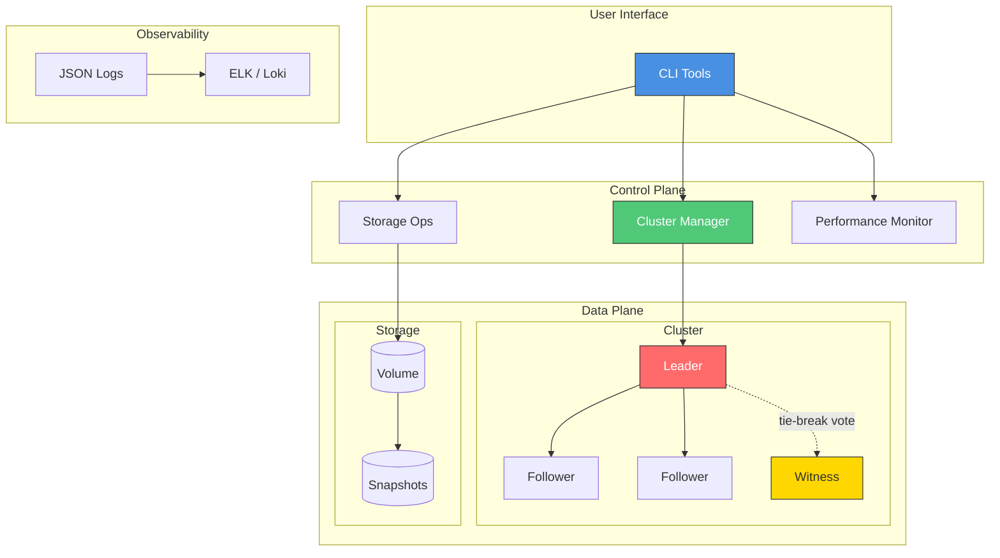

# Quorum CLI

A command-line toolset for managing distributed storage clusters: replication, quorum consensus, failure injection, and monitoring, built entirely with Bash and standard Linux tools (no Cassandra, Kafka, or other binary dependency — node behavior is simulated on top of plain files and processes).

## Overview

- Multi-node cluster lifecycle management (simulated Cassandra/Kafka-style clusters)
- Quorum-based replication with an optional Witness node for even-sized clusters
- Storage volume provisioning, snapshots, and integrity checks
- Real-time performance monitoring and Prometheus-format metrics
- Chaos engineering: node kills, network partitions, disk/data-corruption scenarios
- Structured JSON logging alongside human-readable logs
- `--dry-run` on every command that writes to disk

## Architecture


```mermaid
graph TB
    subgraph "User Interface"
        CLI[CLI Tools]
    end

    subgraph "Control Plane"
        CM[Cluster Manager]
        SO[Storage Ops]
        PM[Performance Monitor]
    end

    subgraph "Data Plane"
        subgraph "Cluster"
            N1[Leader]
            N2[Follower]
            N3[Follower]
            W[Witness]
        end

        subgraph "Storage"
            V1[(Volume)]
            SNAP[(Snapshots)]
        end
    end

    subgraph "Observability"
        LOG[JSON Logs]
        ELK[ELK / Loki]
    end

    CLI --> CM
    CLI --> SO
    CLI --> PM

    CM --> N1
    SO --> V1
    V1 --> SNAP

    N1 --> N2
    N1 --> N3
    N1 -.->|tie-break vote| W

    LOG --> ELK

    style CLI fill:#4A90E2,stroke:#333,color:#fff
    style CM fill:#50C878,stroke:#333,color:#fff
    style N1 fill:#FF6B6B,stroke:#333,color:#fff
    style W  fill:#FFD700,stroke:#333,color:#333
```

## Engineering notes

### 1. Strict mode

Every script starts with:
```bash
#!/usr/bin/env bash
set -euo pipefail
IFS=$'\n\t'
```

| Flag | What it does |
|------|--------------|
| `-e` | Exit immediately if any command fails, instead of continuing on a corrupt state |
| `-u` | Error on unset variables (catches `rm -rf $UNSET_VAR/*`-class bugs) |
| `-o pipefail` | A failed pipe stage (`grep \| awk`) fails the whole pipeline, not just the last stage |
| `IFS` | Word-split only on newline/tab, so node names or paths with spaces don't silently break loops |

### 2. Structured JSON logging

Every `log_info`/`log_warn`/`log_error`/`log_success` call also appends a line to a sibling `*.json.log` file:

```bash
$ tail -3 logs/cluster/cluster-manager.json.log
{"timestamp":"2026-08-09T06:42:03Z","level":"INFO","message":"Creating cluster: prod-cluster"}
{"timestamp":"2026-08-09T06:42:03Z","level":"INFO","message":"Provisioning 3 nodes..."}
{"timestamp":"2026-08-09T06:42:04Z","level":"SUCCESS","message":"Cluster created successfully!"}
```

Timestamps are UTC ISO-8601, independent of the local-time format used in the plain-text log. Point Filebeat/Promtail at `logs/*/*.json.log` to ship to Elasticsearch or Loki.

### 3. `--dry-run` on every write path

`create`, `storage-ops.sh provision`, and every `chaos-engineering.sh` scenario accept `--dry-run`. It logs exactly what would run and exits before touching disk:

```bash
$ ./bin/cluster-manager.sh create --name prod --nodes 5 --dry-run
[INFO ] Creating cluster: prod
[INFO ] Type: cassandra, Nodes: 5, Replication: 3
[WARN ] DRY-RUN: Would create cluster 'prod' (cassandra, 5 nodes, replication=3)
[WARN ] DRY-RUN: No files created.

Cluster name: prod (dry-run — not persisted)
Nodes: 5
Type: cassandra
```

### 4. Witness node / force-quorum

Even-sized clusters (2, 4, ...) can split 50/50, and neither half can reach majority on its own. `create --force-quorum` adds a Witness: a lightweight node that gets a vote but holds no data.

```bash
$ ./bin/cluster-manager.sh create --name two-node --nodes 2 --force-quorum
[INFO ] Creating cluster: two-node
[WARN ] Even node count (2) detected — a 50/50 split cannot reach quorum.
[SUCCESS] --force-quorum: Witness node 'node-3' added as tie-breaker

Cluster ID: cls-1785660112-a41c9e
Witness: node-3 (force_quorum_enabled=true)
```

Quorum math: `floor(total/2) + 1`. With the witness counted, a 2-node cluster needs 2 of 3 votes instead of splitting 1-1. You can also add a witness after the fact with `add-witness --cluster-id <id>`, and check for one programmatically with `is_witness_enabled` / `get_witness_node_id` in `lib/cluster-lib.sh`.

### 5. Network partition (iptables, chaos)

`partition` and `heal-partition` model the case that actually breaks naive consensus code: the isolated node's process keeps running and believes it's healthy, while the rest of the cluster sees it as gone.

```bash
$ ./scripts/chaos-engineering.sh partition --target-node 192.168.1.102
[WARN] CHAOS: Creating network partition for 192.168.1.102
[WARN] apply iptables DROP rule for 192.168.1.0/24 (would run: ssh 192.168.1.102 sudo iptables -A INPUT -s 192.168.1.0/24 -j DROP)
```

As of this version, `partition`/`heal-partition` construct and print the SSH/iptables command rather than executing it against a real host — wiring for real remote execution isn't in yet. `network-partition` (a separate scenario, see below) simulates the same effect purely in local state and needs no SSH access, which is why it's the one the demo and test suite exercise end to end.

## Live demo results

### Cluster status
```
╔════════════════════════════════════════════════════════════════╗
║          CLUSTER STATUS: production-cluster                    ║
╚════════════════════════════════════════════════════════════════╝

Cluster ID:          cls-1771139913-f015c8
Name:                production-cluster
Status:              HEALTHY
Node Count:          3

Nodes:
  node-1 [LEADER]      UP    Load: 26%    Address: 192.168.1.101:7001
  node-2 [FOLLOWER]    UP    Load: 24%    Address: 192.168.1.102:7002
  node-3 [FOLLOWER]    UP    Load: 31%    Address: 192.168.1.103:7003
```

### Test results
```
Tests Run:      40
Tests Passed:   40
Success Rate:   100%

✓ ALL TESTS PASSED!
```
Plus 104 BATS tests (`./tests/bats-vendor/bin/bats tests/`), also 104/104. See Testing below for the breakdown.

## Quick start

```bash
git clone https://github.com/joshuabvarghese/Quorum-CLI.git
cd Quorum-CLI

chmod +x bin/*.sh scripts/*.sh tests/*.sh

./bin/cluster-manager.sh init
./scripts/demo.sh
```

## Commands reference

### Cluster management

```bash
./bin/cluster-manager.sh init
./bin/cluster-manager.sh create --name prod-cluster --nodes 3 --type cassandra
./bin/cluster-manager.sh create --name prod --nodes 5 --dry-run
./bin/cluster-manager.sh create --name two-node --nodes 2 --force-quorum
./bin/cluster-manager.sh status --cluster-id cls-001 --verbose
./bin/cluster-manager.sh list
./bin/cluster-manager.sh add-node --cluster-id cls-001
./bin/cluster-manager.sh add-witness --cluster-id cls-001
./bin/cluster-manager.sh metrics --cluster-id cls-001
```

### Storage operations

```bash
./bin/storage-ops.sh provision --cluster-id cls-001 --size 10GB --replication 3
./bin/storage-ops.sh snapshot --volume-id vol-001 --retention 7d
./bin/storage-ops.sh verify --volume-id vol-001
./bin/storage-ops.sh list
./bin/storage-ops.sh stats
./bin/storage-ops.sh provision --size 100GB --dry-run
```

### Performance monitoring

```bash
./bin/perf-monitor.sh dashboard --cluster-id cls-001
./bin/perf-monitor.sh analyze --cluster-id cls-001
./bin/perf-monitor.sh report --cluster-id cls-001 --output report.txt
```

### Chaos engineering

```bash
# Node failure
./scripts/chaos-engineering.sh kill-node --cluster-id cls-001 --node-id node-2 --auto-recover

# Network partition — prints the SSH/iptables command it would run (see note above)
./scripts/chaos-engineering.sh partition --target-node 192.168.1.102
./scripts/chaos-engineering.sh heal-partition --target-node 192.168.1.102

# Simulated partition, local state only, no SSH required
./scripts/chaos-engineering.sh network-partition --cluster-id cls-001 --partition "1,2" "3"

# Other scenarios
./scripts/chaos-engineering.sh high-load --cluster-id cls-001 --duration 60
./scripts/chaos-engineering.sh slow-network --cluster-id cls-001 --duration 100
./scripts/chaos-engineering.sh disk-failure --cluster-id cls-001 --node-id node-2
./scripts/chaos-engineering.sh data-corruption --cluster-id cls-001 --volume-id vol-001

# Always preview first
./scripts/chaos-engineering.sh kill-node --cluster-id cls-001 --node-id node-2 --dry-run
```

## Project structure

```
Quorum-CLI/
├── bin/
│   ├── cluster-manager.sh    # Cluster lifecycle management
│   ├── storage-ops.sh        # Volume, snapshot, integrity ops
│   └── perf-monitor.sh       # Real-time performance monitoring
├── lib/
│   ├── logger.sh             # Logging framework (human + JSON structured)
│   ├── cluster-lib.sh        # Quorum math, health checks, leader election
│   └── network_checks.sh     # SSH pre-flight, iptables checks, port tests
├── scripts/
│   ├── demo.sh               # End-to-end automated demo
│   └── chaos-engineering.sh  # Failure injection scenarios
├── tests/
│   ├── run_tests.sh          # Master test runner (40 inline tests + ShellCheck)
│   ├── integration-tests.sh  # Legacy integration suite
│   ├── quorum_math.bats      # BATS: quorum logic unit tests
│   ├── cluster_manager.bats  # BATS: cluster-manager.sh integration tests
│   ├── storage_ops.bats      # BATS: storage-ops.sh integration tests
│   ├── chaos_engineering.bats# BATS: chaos scenarios + dry-run validation
│   ├── logging.bats          # BATS: JSON logger unit tests
│   ├── network_checks.bats   # BATS: network_checks.sh unit tests
│   └── bats-vendor/          # Vendored bats-core (works offline/CI, no install needed)
├── config/
│   └── cluster.conf          # Cluster defaults
├── logs/
│   ├── cluster/               # cluster-manager logs (text + JSON)
│   ├── monitoring/            # perf-monitor logs
│   └── storage/               # storage-ops logs
├── RUNBOOK.md                # SRE incident response playbook
├── POST-MORTEM.md            # Post-mortem: silent quorum loss incident
└── SHELLCHECK_REPORT.md      # ShellCheck audit and fixes
```

## Testing

```bash
# Master test runner: inline unit + integration tests, plus a ShellCheck pass
./tests/run_tests.sh
# Expected: 40/40 passed, 100% pass rate

# BATS suite: isolated per-test
./tests/bats-vendor/bin/bats tests/
# Expected: 104/104 passed

# Individual BATS files
./tests/bats-vendor/bin/bats tests/quorum_math.bats
./tests/bats-vendor/bin/bats tests/network_checks.bats
./tests/bats-vendor/bin/bats tests/storage_ops.bats
```

144 tests total between the two runners. A handful of the BATS tests exist specifically to pin down non-obvious behavior:

```bash
@test "quorum: 2 node cluster 50/50 split = quorum LOST (the dangerous case)"
# Proves why even-sized clusters without a witness are dangerous.

@test "check_cluster_health: 2 of 3 nodes down = UNHEALTHY (quorum lost)"
# Mocks a 3-node cluster on disk, kills 2 nodes, asserts UNHEALTHY.

@test "chaos kill-node --dry-run: does NOT modify node metadata"
# Before/after metadata comparison proves dry-run is truly non-destructive.
```

## ShellCheck compliance

All 8 scripts (`bin/*.sh`, `lib/*.sh`, `scripts/chaos-engineering.sh`, `scripts/demo.sh`) pass ShellCheck with zero warnings, including info-level. See [`SHELLCHECK_REPORT.md`](SHELLCHECK_REPORT.md) for the fix history.

```bash
# Run it yourself (requires shellcheck; -x lets it follow `source` across files)
shellcheck -x bin/*.sh lib/*.sh scripts/chaos-engineering.sh scripts/demo.sh
```

## Troubleshooting

### "Cluster not found: cls-xxx"

```bash
./bin/cluster-manager.sh list
# If empty: ./bin/cluster-manager.sh init && ./bin/cluster-manager.sh create ...
```

### "Quorum LOST — write operations disabled"

```bash
# Check how many nodes are actually up
./bin/cluster-manager.sh status --cluster-id <id> --verbose

# Recover downed nodes
./scripts/chaos-engineering.sh kill-node --cluster-id <id> --node-id <node> --auto-recover

# For even-sized clusters, add a Witness so a 50/50 split can't happen:
./bin/cluster-manager.sh add-witness --cluster-id <id>
```

### "SSH unreachable / node not responding"

```bash
# Pre-flight check (TCP-level only, does not partition anything)
bash -c "
  source lib/logger.sh
  source lib/network_checks.sh
  pre_flight_checks 192.168.1.101 192.168.1.102
"
# Outputs: which nodes are reachable, which are not, and why
```

### "Script failed partway through — cluster in unknown state"

`set -euo pipefail` means the script stopped at the first error rather than continuing on a corrupt state. Verify directly:

```bash
./bin/cluster-manager.sh status --cluster-id <id> --verbose
./bin/storage-ops.sh verify --volume-id <vol-id>

# Check the audit log for what actually ran
tail -50 logs/cluster/cluster-manager.json.log | python3 -c "
import sys, json
for l in sys.stdin:
    try:
        obj = json.loads(l)
        print(f\"[{obj['timestamp']}] {obj['level']}: {obj['message']}\")
    except ValueError:
        pass
"
```

### "Tests failing after changes"

```bash
./tests/run_tests.sh
# Failure group tells you where to look:
# [1/6] ShellCheck Compliance  — strict mode, quoting, or a source path changed
# [2/6] Quorum Math            — quorum_threshold or check_quorum logic changed
# [3/6] Cluster Lifecycle      — cluster-manager.sh regression
# [4/6] Storage Operations     — storage-ops.sh regression
# [5/6] Dry-Run Safety         — --dry-run no longer prevents writes
# [6/6] Structured Logging     — log_json format changed
```

## Incident response

For full incident playbooks, see [RUNBOOK.md](RUNBOOK.md).

For a real example of how this tooling was used to diagnose and fix a production incident, see [POST-MORTEM.md](POST-MORTEM.md): a documented account of a silent quorum loss during a rolling restart, including root cause, timeline, and the code changes made.
