# Quorum CLI - Distributed Storage Platform


A production-grade command-line tool suite for managing distributed storage systems, data replication, and cluster operations — built entirely with Linux CLI tools.

---

## 🎯 Project Overview

This project simulates a distributed storage platform with:
- **Multi-node cluster management** (simulated Cassandra/Kafka-like clusters)
- **Data replication and consistency checking** (quorum-based with Witness support)
- **Storage performance monitoring and optimization** (real-time metrics)
- **Automated backup and disaster recovery** (snapshots with retention)
- **Cluster health monitoring and auto-remediation** (leader election, failover)
- **Network partition detection and handling** (iptables-based chaos engineering)
- **Structured JSON logging** (ELK / Grafana Loki compatible)
- **Dry-run safety mode** (every destructive operation is preview-safe)

---

## 🏗️ System Architecture

```mermaid
graph TB
    subgraph "User Interface"
        CLI[CLI Tools]
    end

    subgraph "Control Plane"
        CM[Cluster Manager]
        SO[Storage Ops]
        PM[Performance Monitor]
    end

    subgraph "Data Plane"
        subgraph "Cluster"
            N1[Leader]
            N2[Follower]
            N3[Follower]
            W[Witness 🗳️]
        end

        subgraph "Storage"
            V1[(Volume)]
            SNAP[(Snapshots)]
        end
    end

    subgraph "Observability"
        LOG[JSON Logs]
        ELK[ELK / Loki]
    end

    CLI --> CM
    CLI --> SO
    CLI --> PM

    CM --> N1
    SO --> V1
    V1 --> SNAP

    N1 --> N2
    N1 --> N3
    N1 -.->|tie-break vote| W

    LOG --> ELK

    style CLI fill:#4A90E2,stroke:#333,color:#fff
    style CM fill:#50C878,stroke:#333,color:#fff
    style N1 fill:#FF6B6B,stroke:#333,color:#fff
    style W  fill:#FFD700,stroke:#333,color:#333
```



---

## 🛡️ Engineering Standards

### 1. Bash Strict Mode (Safety Layer)

Every script starts with:
```bash
#!/usr/bin/env bash
set -euo pipefail
IFS=$'\n\t'
```

| Flag | What it does |
|------|--------------|
| `-e` | Exit immediately if any command fails — stops cascading failures |
| `-u` | Error on unset variables — prevents `rm -rf $UNSET_VAR/*` disasters |
| `-o pipefail` | A failed pipe stage (`grep \| awk`) fails the whole pipeline |
| `IFS` | Word-split only on newline/tab — safe for node names with spaces |

### 2. Structured JSON Logging (ELK-compatible)

All log calls also emit a JSON event to `*.json.log` for machine ingestion:

```bash
log_json "INFO" "Quorum achieved with 3/5 nodes"
# → {"timestamp":"2026-02-22T10:00:00Z","level":"INFO","message":"Quorum achieved with 3/5 nodes"}
```

Pipe to Elasticsearch or Grafana Loki:
```bash
tail -f logs/cluster/cluster-manager.json.log | curl -X POST http://loki:3100/loki/api/v1/push ...
```

### 3. Dry-Run Mode (Safety Valve)

Every script with side effects supports `--dry-run`. Before any `ssh`, `iptables`, `mkdir`, or `sed` runs, it prints exactly what it would do:

```bash
./bin/cluster-manager.sh create --name prod --nodes 3 --dry-run
# [WARN ] 🔍 DRY-RUN mode enabled — no changes will be made.
# [DRY-RUN] Would execute: Create cluster directory structure
#           Command: mkdir -p /data/clusters/cls-xxx/{nodes,metadata,state}
```

### 4. Witness Node / Force-Quorum

Even-sized clusters (2, 4, …) cannot achieve quorum (majority) when split 50/50.  
Use `--force-quorum` to automatically spin up a lightweight **Witness** node that counts as a vote but stores no data:

```bash
./bin/cluster-manager.sh create --name two-node --nodes 2 --force-quorum
# [WARN ] Even node count (2) detected — quorum is not guaranteed on split.
# [INFO ] 🗳️  --force-quorum: spinning up Witness node as tie-breaker (+1 vote, no data).
# Nodes: 2 + 1 witness (quorum tie-breaker)
```

Quorum math: `floor(total/2) + 1` — a 2+1 witness cluster needs 2 votes to proceed.

### 5. iptables Network Partition (Chaos)

Real partition simulation using OS-level firewall rules — the partitioned node's process keeps running and believes it's healthy, which is the exact scenario that exposes flaws in distributed consensus:

```bash
# Partition node 192.168.1.102 from the rest of the cluster
./scripts/chaos-engineering.sh partition --target-node 192.168.1.102

# The script SSHes into the target and runs:
#   sudo iptables -A INPUT  -s 192.168.1.0/24 -j DROP
#   sudo iptables -A OUTPUT -d 192.168.1.0/24 -j DROP

# Restore connectivity
./scripts/chaos-engineering.sh heal-partition --target-node 192.168.1.102
```

---

## 📋 Live Demo Results

### Cluster Status
```
╔════════════════════════════════════════════════════════════════╗
║          CLUSTER STATUS: production-cluster                    ║
╚════════════════════════════════════════════════════════════════╝

Cluster ID:          cls-1771139913-f015c8
Name:                production-cluster
Status:              HEALTHY
Node Count:          3

Nodes:
  node-1 [LEADER]      UP    Load: 26%    Address: 192.168.1.101:7001
  node-2 [FOLLOWER]    UP    Load: 24%    Address: 192.168.1.102:7002
  node-3 [FOLLOWER]    UP    Load: 31%    Address: 192.168.1.103:7003
```

### Test Results
```
Tests Run:      10
Tests Passed:   10
Success Rate:   100%

✓ ALL TESTS PASSED!
```

---

## 🚀 Quick Start

```bash
# Clone and setup
git clone https://github.com/joshuabvarghese/Quorum-CLI.git
cd Quorum-CLI

# Make scripts executable
chmod +x bin/*.sh scripts/*.sh tests/*.sh

# Initialize
./bin/cluster-manager.sh init

# Run full demo
./scripts/demo.sh
```

---

## 🔧 Commands Reference

### Cluster Management

```bash
./bin/cluster-manager.sh init
./bin/cluster-manager.sh create --name prod-cluster --nodes 3 --type cassandra
./bin/cluster-manager.sh create --name two-node --nodes 2 --force-quorum
./bin/cluster-manager.sh status --cluster-id cls-001 --verbose
./bin/cluster-manager.sh list
./bin/cluster-manager.sh add-node --cluster-id cls-001
./bin/cluster-manager.sh create --name prod --nodes 5 --dry-run
```

### Storage Operations

```bash
./bin/storage-ops.sh provision --cluster-id cls-001 --size 10GB --replication 3
./bin/storage-ops.sh snapshot --volume-id vol-001 --retention 7d
./bin/storage-ops.sh verify --volume-id vol-001
./bin/storage-ops.sh list
./bin/storage-ops.sh stats
./bin/storage-ops.sh provision --size 100GB --dry-run
```

### Performance Monitoring

```bash
./bin/perf-monitor.sh dashboard --cluster-id cls-001
./bin/perf-monitor.sh analyze --cluster-id cls-001
./bin/perf-monitor.sh report --cluster-id cls-001 --output report.txt
```

### Chaos Engineering

```bash
# Node failure
./scripts/chaos-engineering.sh kill-node --cluster-id cls-001 --node-id node-2 --auto-recover

# Real iptables network partition (requires SSH access to nodes)
./scripts/chaos-engineering.sh partition --target-node 192.168.1.102
./scripts/chaos-engineering.sh heal-partition --target-node 192.168.1.102

# Simulated partition (local state only)
./scripts/chaos-engineering.sh network-partition --cluster-id cls-001 --partition "1,2" "3"

# Other chaos scenarios
./scripts/chaos-engineering.sh high-load --cluster-id cls-001 --duration 60
./scripts/chaos-engineering.sh slow-network --cluster-id cls-001 --duration 100
./scripts/chaos-engineering.sh disk-failure --cluster-id cls-001 --node-id node-2
./scripts/chaos-engineering.sh data-corruption --cluster-id cls-001 --volume-id vol-001

# Always preview first
./scripts/chaos-engineering.sh partition --target-node 192.168.1.102 --dry-run
```

---

## 📁 Project Structure

```
Quorum-CLI/
├── bin/
│   ├── cluster-manager.sh    # Cluster lifecycle management
│   ├── storage-ops.sh        # Volume, snapshot, integrity ops
│   └── perf-monitor.sh       # Real-time performance monitoring
├── lib/
│   ├── logger.sh             # Logging framework (human + JSON)
│   └── cluster-lib.sh        # Quorum math, health, leader election
├── scripts/
│   ├── demo.sh               # End-to-end automated demo
│   └── chaos-engineering.sh  # iptables partition + failure simulation
├── tests/
│   └── integration-tests.sh  # Full integration test suite
├── config/
│   └── cluster.conf          # Cluster defaults
└── logs/
    ├── cluster/              # cluster-manager logs (text + JSON)
    ├── monitoring/           # perf-monitor logs
    └── storage/              # storage-ops logs
```

---

## 🧪 Testing

```bash
# Run all integration tests
./tests/integration-tests.sh
```

---